# PoC and test Observability LLM

A simple Python-based microservice project demonstrating how to instrument a simple deployment and user telemetry to visualize data from **traces**, **profiling**, and derived  **metrics**, using [OpenTelemetry](https://opentelemetry.io/), [Grafana Tempo](https://grafana.com/oss/tempo/), [Mimir](https://grafana.com/oss/mimir/), and [Pyroscope](https://pyroscope.io/).

The example includes a **FastAPI-based client** that triggers telemetry traffic, a **FastAPI server** that calls both a **mock LLM backend** (simulating inference with latency and failures), and to **OpenAI API** to verify or enrich results.

This forms a tracing chain as follows:

**Client ➜ Server ➜ Mock LLM ➜ OpenAI**

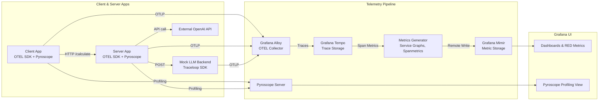

## Usage

You must create a `.env` file at the root of the project with your OpenAI credentials:

```
OPENAI_API_KEY=your-api-key-here
```

To get started, use the provided `Makefile` targets. Run `make` to see available options:

```bash
➜ make
Usage:
        make <target>
Targets:
        help                           Show this help
        up                             docker-compose up
        stop                           docker-compose stop
        ps                             docker-compose ps
        logs                           docker-compose logs
```

## Start the Stack

```bash
make up
```

Then access:
- **Grafana**: [http://localhost:3000](http://localhost:3000) — no login required

## Stop the Stack

```bash
make stop
```

## Overview of Each Backend

This PoC sets up a self-contained observability stack that includes **Grafana Alloy**, **Tempo**, **Mimir**, **Pyroscope**, and **Grafana**. Each component plays a specific role in the observability pipeline:

### Grafana Alloy (OpenTelemetry Collector)

Grafana Alloy serves as the **collector and forwarder** for telemetry data:
- Receives **traces** from the instrumented Python FastAPI client and server via the **OTLP gRPC exporter**.
- Forwards spans to **Tempo** for storage and processing.
- Can be extended to send logs or metrics to other backends (not used here yet).

Alloy simplifies ingestion, handles batching, retries, and offers a central point to configure telemetry pipelines.

### Grafana Mimir (Metrics)

Mimir acts as the **Prometheus-compatible metrics backend**. In this setup, it stores **metrics generated by Tempo**'s `metrics_generator`, such as:
- `traces_spanmetrics_calls_total` — counts, durations, and errors derived from spans.
- `traces_service_graph_request_total` — service graph edge counts.

These are written to Mimir via `remote_write` and queried from Grafana to build RED dashboards.

### Grafana Tempo (Traces)

Tempo is the **distributed tracing backend**:
- Stores and indexes spans received from Alloy.
- Includes a **metrics generator** that turns traces into Prometheus-style metrics.
- Pushes those metrics to **Mimir**, enabling alerting and RED dashboarding based on tracing data alone.

This means you can get observability without changing your code to emit Prometheus metrics directly.

### Pyroscope (Profiling)

Pyroscope continuously captures CPU profiles of both client and server via native Python integration. This enables:
- High-resolution profiling of requests.
- Correlation of heavy code paths with spans and trace IDs.

Profiles are visualized in Grafana using the Pyroscope plugin.

### Grafana (Visualization Layer)

Grafana is the single pane of glass for:
- Viewing traces via the Tempo data source.
- Exploring CPU profiles via the Pyroscope plugin.
- Building dashboards using Mimir metrics.
- Viewing service graphs with RED indicators based on span metrics.

> **Note:** Grafana runs without authentication in this demo and is available on port `3000`.


Traces flow through Alloy → Tempo → Mimir and Grafana, enabling observability with minimal setup.

## Pyroscope Profiling

This PoC includes continuous profiling using [Pyroscope](https://pyroscope.io/), integrated into both the client and server Python applications. Pyroscope is connected via the `pyroscope` Python SDK, and profiling data is visualized through Grafana.

The profiling mode used is `process_cpu`, capturing CPU usage over time. This is useful for identifying bottlenecks, high CPU usage paths, and inefficiencies in application execution.

### Profiling: simple.python.client

#### 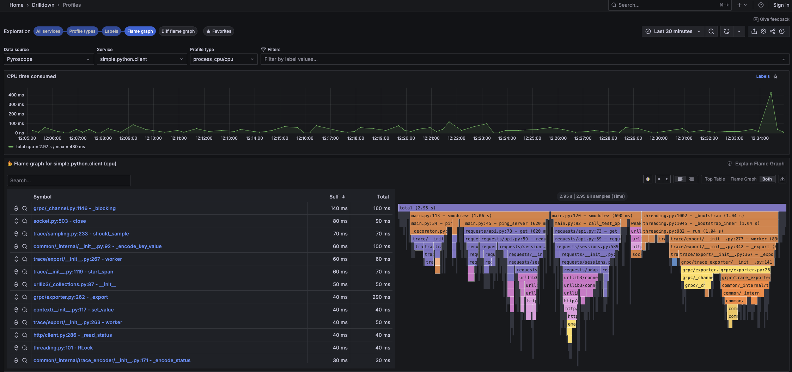

In this view, we see the client's CPU usage over time while making repeated requests to the server. The flame graph shows CPU consumption broken down by function calls. Notable highlights:

- The largest CPU-consuming function is the `ping_server` method, which issues a health check.
- The `requests` library stack is visible under `requests/api.py:get` and `requests/sessions.py:request`, showing the HTTP GET flow.
- Sampling and GRPC exporter spans from the OTLP SDK are visible, confirming OpenTelemetry overhead is being profiled as well.

#### 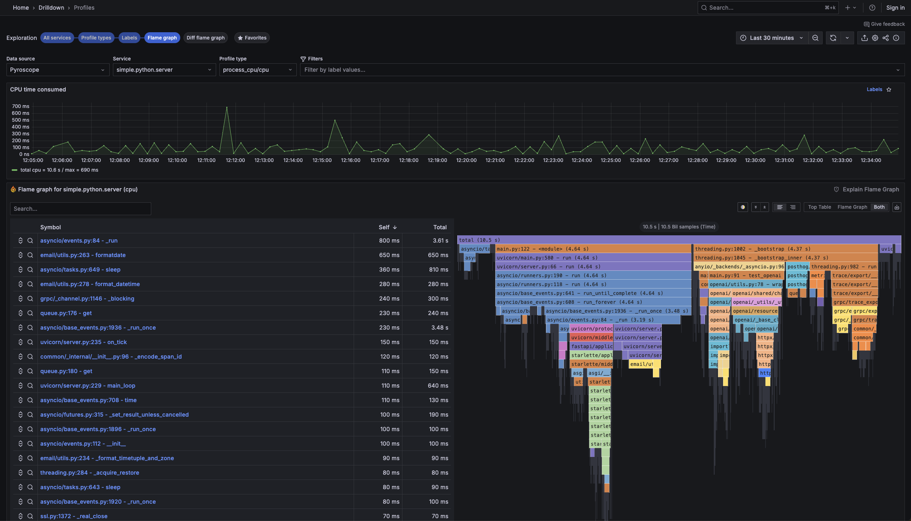

A variation of the previous graph showing CPU load concentrated during a call to `call_test_openai`. This provides insight into how much processing is involved when tracing spans across an external dependency like the OpenAI API.

### Profiling: simple.python.server

#### 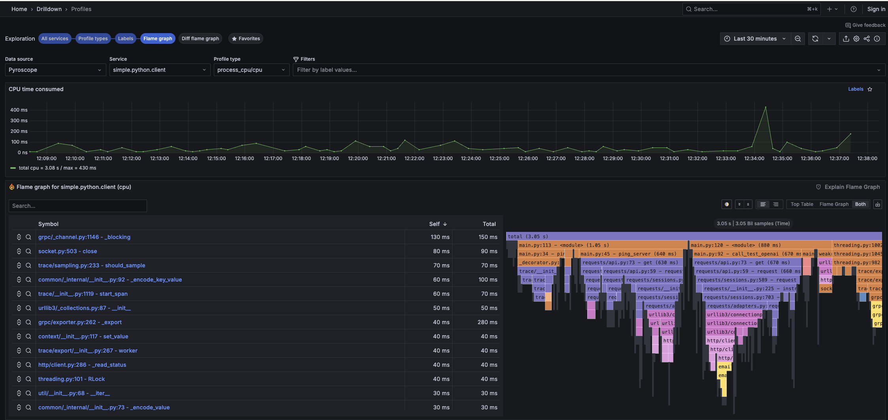

This profile shows the FastAPI server under typical request load. Key insights:

- The `uvicorn/server.py` event loop is responsible for the majority of processing time.
- The `GET /test-openai` endpoint leads into the `openai` Python package, showing how external synchronous calls are processed.
- Sampling and export spans indicate OpenTelemetry export activity.

#### 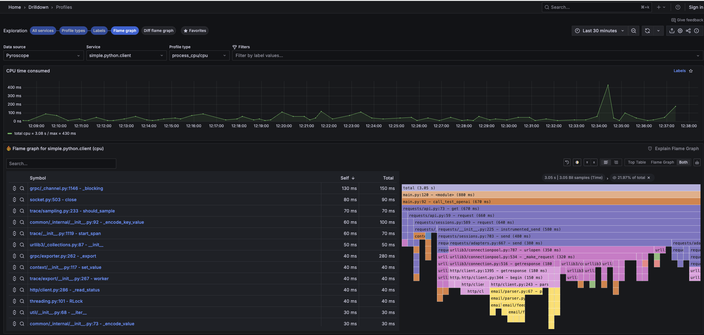

This snapshot shows a `GET /calculate` request profile. You can observe time spent parsing the prompt, generating the request to OpenAI, and exporting traces via gRPC.

#### 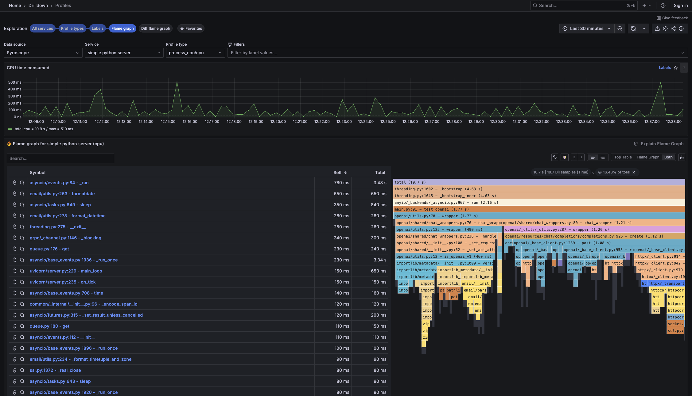

The final flame graph provides a broader sample window and highlights multiple overlapping requests. Notable here is the CPU consumption across async frameworks (`asyncio`, `uvicorn`) and OpenTelemetry’s exporter.

### Diff Flame Graph: Comparing Server Behavior

#### 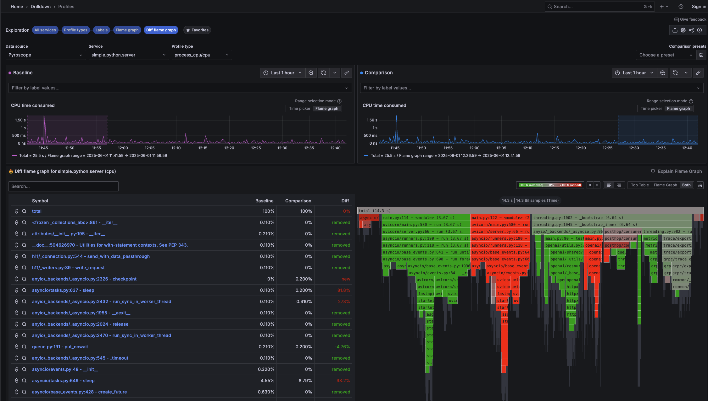

This view compares two different CPU profiles collected from the `simple.python.server` service.

- **Left panel (purple):** Baseline time range
- **Right panel (blue):** Comparison time range

In the flame graph below:
- **Green** represents functions where CPU time **decreased** in the comparison.
- **Red** represents functions where CPU time **increased**.
- **Gray** sections are unchanged.

Notable observations:
- `main.py` and `uvicorn` server event loop show significant increases in CPU time during the comparison window.
- Async I/O operations such as `run_once`, `run_forever`, and `worker_thread` are prominently red, indicating increased activity—likely due to a spike in traffic or more expensive operations during that timeframe.
- The right-side trace export and OpenAI blocks are still present but mostly unchanged (gray).

This visualization is extremely useful for identifying regressions, performance issues, or improvements introduced by recent code or workload changes.

## Tracing

This PoC includes OpenTelemetry tracing with both client and server instrumented in Python. Traces are exported via OTLP to **Grafana Alloy**, which then forwards them to **Grafana Tempo** for storage and **Grafana Mimir** for generating RED metrics and service graphs.

### Key Features:
- Automatic trace context propagation between services using OTLP
- Error-aware spans using `StatusCode.ERROR` for clear failure visibility
- Real-time visualizations of service dependencies and latencies via Tempo
- RED metrics (Rate, Error, Duration) derived from spans using Tempo's metrics generator

### Tempo Drilldown & Trace Explorer

####  1. Trace Overview – Tempo Drilldown
This dashboard gives an overview of trace activity over time. The top panel displays span rate, error rate, and latency distribution across all spans. The table below lists recent traces initiated by `simple.python.client`, including their duration and associated operations.

This view is helpful for:
- Detecting spikes in latency or error rate
- Investigating outlier requests
- Quickly accessing individual traces for analysis


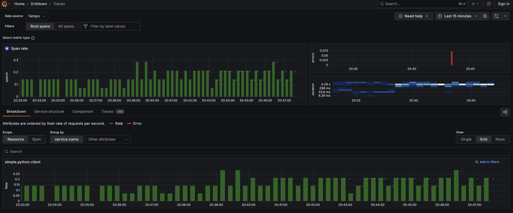


### 2. Trace Structure – Aggregated View of Spans
The Service Structure view shows how individual spans are structured across services. This aggregated representation helps you understand:
- Time distribution across components
- Downstream dependencies
- Costly or slow operations within the trace

In this example, two representative trace groups are shown:
- `client_request.call_fast` traces with a total duration of `~3.18s`
- `client_request.call_slow` traces with duration `~3.69s`

Each call flows through:
- `server-api` handling `/calculate`
- `mock-llm-backend` POSTing to `/v1/chat/completions`

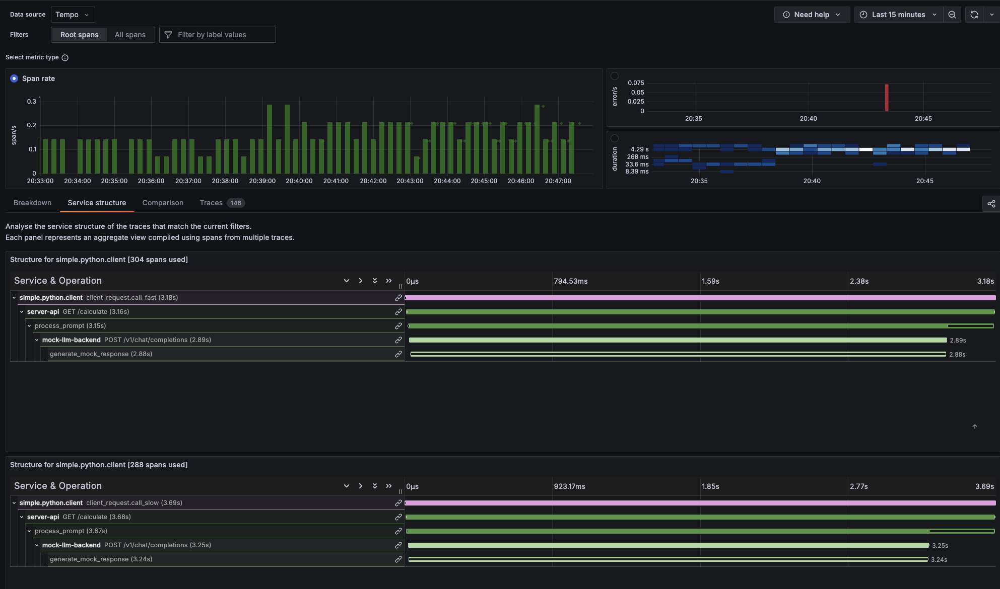

### 3. Span Rate and Breakdown by Service
The Breakdown tab in Grafana shows the RED metrics derived from spans grouped by `service.name`. Here you can:
- Monitor request rate trends
- Identify services with errors (in red)
- Track latency distribution visually

This panel helps spot regressions or identify underperforming services quickly.

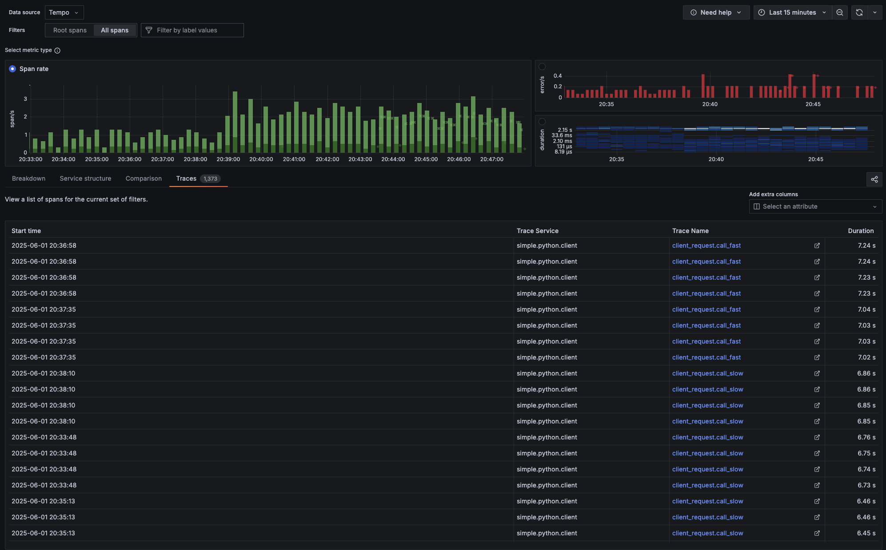


### 4. RED Metrics Table and Service Graph
This panel combines RED metrics and a Tempo-generated service graph.

- The top table lists span names with their rate, error rate, and p90 latency.
- The bottom graph visualizes service dependencies, highlighting successful (green) and failed (red) calls.

In this example, calls to the mock LLM and OpenAI are clearly visible, including failed spans marked in red.

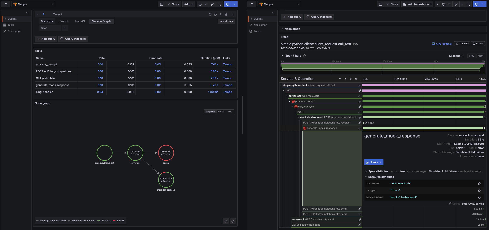

### 5. Node Graph with Full Span Timeline
This graph shows the full execution flow for a selected trace (`client_request.call_fast`). The Node Graph visualizes span relationships, including timing annotations like self-time and percentage of total trace time.

The Timeline view below shows:

- Each span's duration and offset
- Specific failure points, such as simulated LLM failures
- Span attributes like error.message, service.name, and host info

This detailed breakdown helps debug performance bottlenecks or trace specific failures across services.

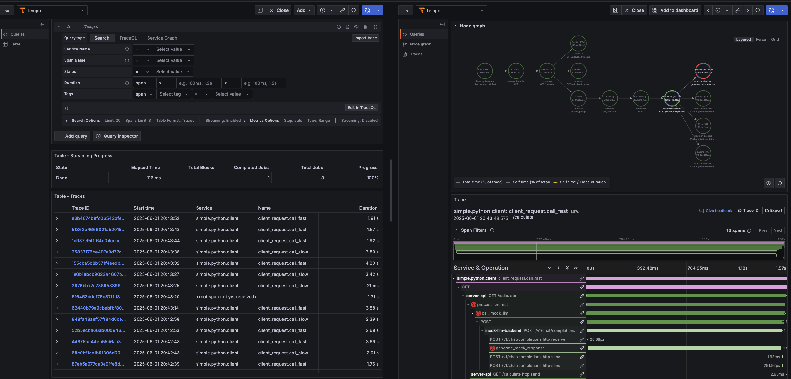
